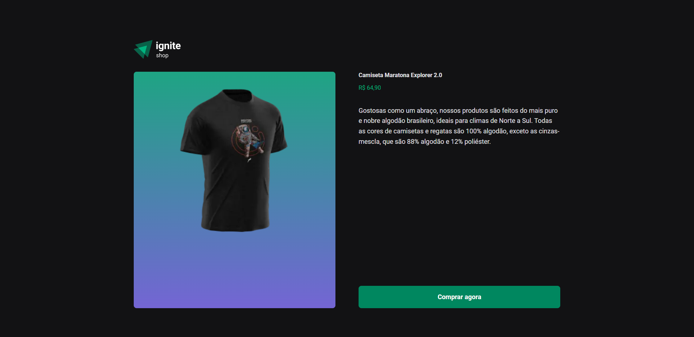

# Ignite Shop
Ignite Shop é um projeto da plataforma de estudos :rocket:[Rocketseat](https://github.com/rocketseat) desenvolvido com [Next.js](https://nextjs.org/).

## Execução
Primeiro, inicie o servidor:

```bash
npm run dev
# ou
yarn dev
```

Abra [http://localhost:3000](http://localhost:3000) no seu browser para visualizar o resultado.

## Screenshots :camera:
<p>
  
  
</p>
